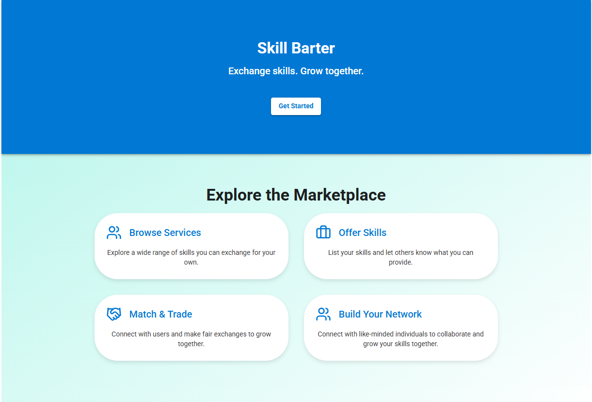

# Skill Bartering Platform

Welcome to the **Skill Bartering Platform** — a web application designed to connect users who want to exchange skills and services without monetary transactions. This platform allows users to request, accept, chat, and complete skill barter transactions in an intuitive and seamless way.

---

## Features

- User registration and profile management  
- Browse marketplace of skills offered by other users  
- Send and receive skill barter requests  
- Real-time chat between users for negotiation and coordination  
- Track request status: accepted, rejected, completed  
- User dashboard with summary of requests and trades  

---

## Demo Screenshots

### Home  


### Marketplace  


### Profile  


### Request Sent  


### Request Received  


### Accepted  


### Rejected  


### Completed  


### Chat  


## Installation

1. Clone the repository  
   ```bash
   git clone https://github.com/Dakshin-priya/SkillBarteringPlatform.git
   cd SkillBarteringPlatform
   

2. Install dependencies

   ```bash
   npm install
   ```

3. Run the application

   ```bash
   npm start
   ```

---

## Technologies Used

* React.js for frontend
* Node.js and Express for backend
* Firebase Firestore for database and real-time chat
* Firebase Authentication for user management
* CSS and Material UI for styling


